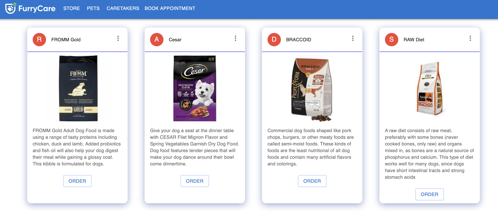
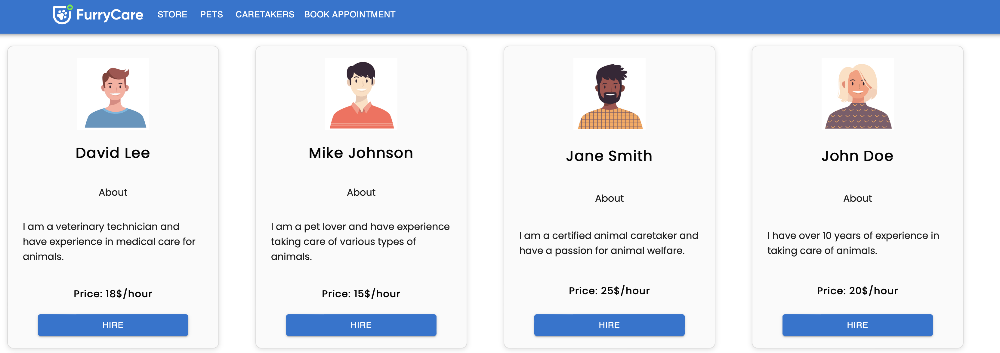
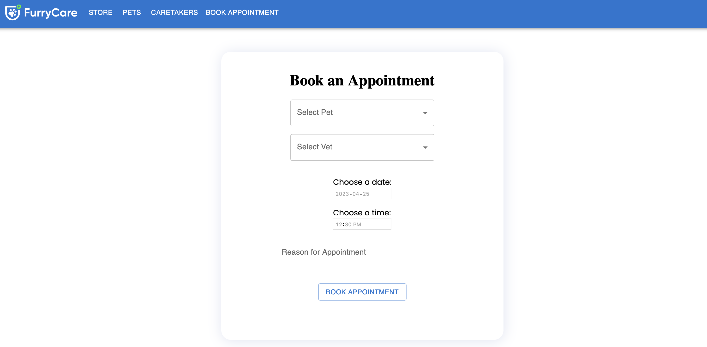
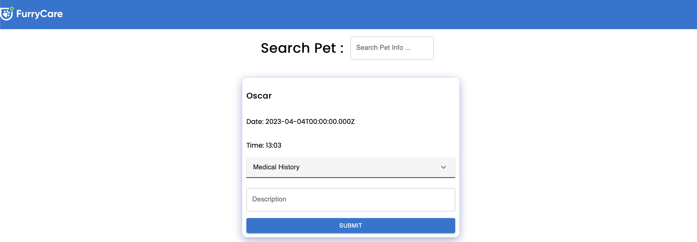
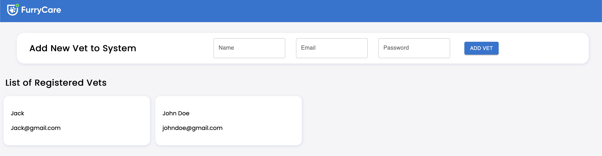

# Furry Care

-A platform where users can register the details of their pets, and Vets can access these details whenever they are giving treatment to that pet. Moreover, users can also buy pet-related products such as food, clothes, and fashion accessories. People can register as caretakers on this platform. Users can book a caretaker for their pets to take care of them for a while.

## Getting Started

### **Prerequisites:**

To run Project on your machine, You need to install git first. Below is the link that will guide you to install Git on your machine.

- [Git Guides - Install Git](https://github.com/git-guides/install-git)

After Installing Git,

The first step is to clone the Group project repo in your machine using the below command. Run the below command at the destination in cmd where you want to clone the repository.

Next, Change the directory to the Frontend side of the project using:

```
cd .\FurryCare\frontend
```

Next step is, run the below command to instal all the packages and dependencies that is required to run the Project.

```
npm install
```

You are all set and now just run the Frontend side using following command.

```
npm run dev
```

Now, To run the Backend of the Project, open the cmd with the path of the project's repo.

Next, Change the directory to the Backend side of the project using:

```
cd .\FurryCare\backend
```

Next step is, run the below command to instal all the packages and dependencies that is required to run the Assignment.

```
npm install
```

You are all set and now just run the backend side using following command.

```
npm run dev
```

Both the server are now up and running.

### **Software/Library/plug-ins**

To have a local copy of this lab / assingnment / project up and running on your local machine, you will first need to install the following software / libraries / plug-ins

- [VS Code](https://code.visualstudio.com/)
- [Node](https://nodejs.org/en/)
- [npm](https://www.npmjs.com/)
- [Express.js](https://expressjs.com/)
- [Postman](https://www.postman.com/)
- [nodemon](https://www.npmjs.com/package/nodemon)
- [mongoose](https://www.npmjs.com/package/mongoose)
- [MongoDB Atlas](https://www.mongodb.com/atlas)
- [MongoDBCompass](https://www.mongodb.com/products/compass)
- [axios](https://www.npmjs.com/package/axios)
- [react](https://react.dev/)
- [react-dom](https://legacy.reactjs.org/docs/react-dom.html)
- [react-router-dom](https://www.npmjs.com/package/react-router-dom)
- [web-vitals](https://www.npmjs.com/package/web-vitals)
- [cors](https://www.npmjs.com/package/cors)
- [dotenv](https://www.npmjs.com/package/dotenv)
- [morgan](https://www.npmjs.com/package/morgan)

### **Built With:**

- [Express.js](https://reactjs.org/)
- [Node](https://nodejs.org/en/)
- [npm](https://www.npmjs.com/)
- [MongoDB](https://www.mongodb.com/)
- [react](https://react.dev/)
- [next](https://www.npmjs.com/package/next)

# Pet Owner Dashboard

### Store



### Caretakers



### Appointments with Vet



# Vet Dashboard

## Vet Dashboard Credentials

### Email: Jack@gmail.com

### Password: Jack@123



# Admin Dashboard

## Admin Dashboard Credentials

### Email: admin@gmail.com

### Password: Admin@123


